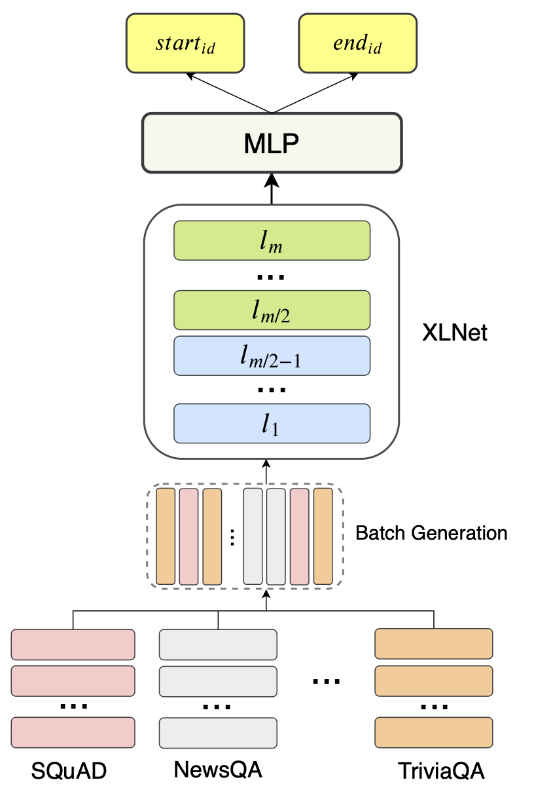
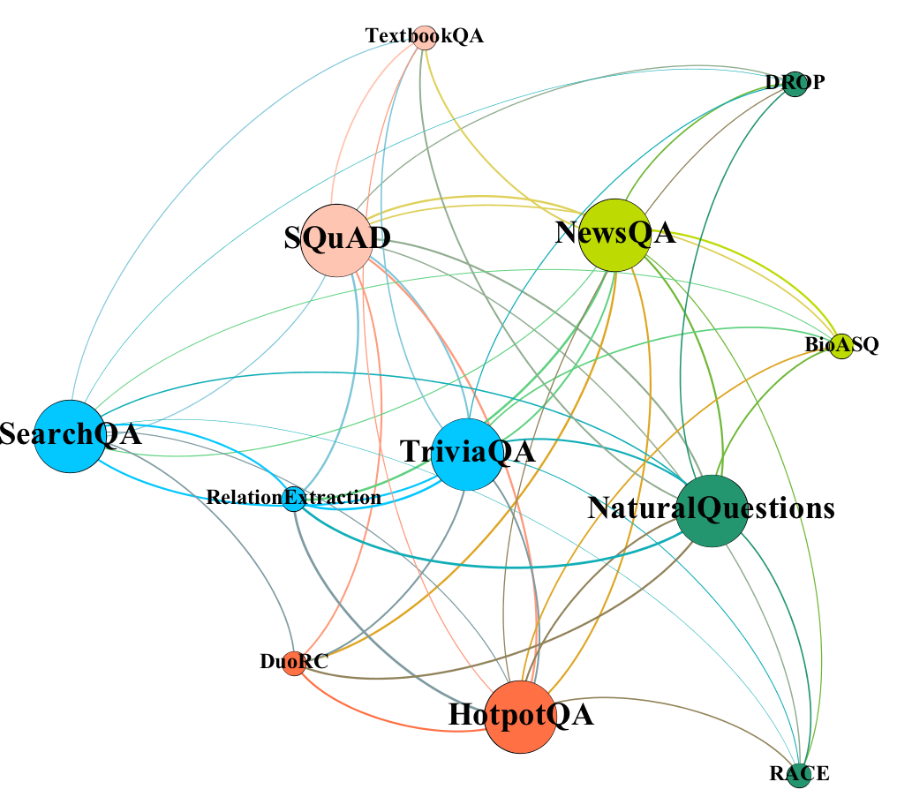
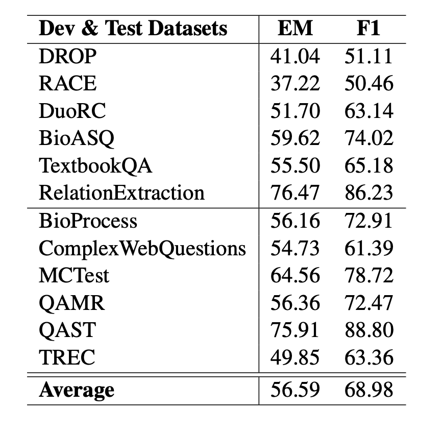

# HLTC-MRQA
 [](https://opensource.org/licenses/MIT) 


This is the TensorFlow implementation of the paper:
**Generalizing Question Answering System with Pre-trained Language Model Fine-tuning**. 

Dan Su*, Yan Xu*, Genta Indra Winata, Peng Xu, Hyeondey Kim, Zihan Liu, Pascale Fung  ***MRQA@EMNLP 2019*** [[PDF]](https://www.aclweb.org/anthology/D19-5827.pdf)

[**Dan Su**]() and [**Yan Xu**](https://github.com/yana-xuyan)  contributed equally to this work. 

The MRQA model can be downloaded by this [link](https://drive.google.com/drive/folders/1yjzYN_KCz8uLobqaUddftBGPAZ6uSDDj?usp=sharing).

If you use our HLTC-MRQA model in your work, please cite the following paper. The bibtex is listed below:
<pre>
@inproceedings{su2019generalizing,
  title={Generalizing Question Answering System with Pre-trained Language Model Fine-tuning},
  author={Su, Dan and Xu, Yan and Winata, Genta Indra and Xu, Peng and Kim, Hyeondey and Liu, Zihan and Fung, Pascale},
  booktitle={Proceedings of the 2nd Workshop on Machine Reading for Question Answering},
  pages={203--211},
  year={2019}
}
</pre>

## Dependency
Check the packages needed or simply run the command
```console
❱❱❱ pip install -r requirements.txt
```

## Abstract
With a large number of datasets being released and new techniques being proposed, Question answering (QA) systems have witnessed great breakthroughs in reading comprehension (RC)tasks. However, most existing methods focus on improving in-domain performance, leaving open the research question of how these mod-els and techniques can generalize to out-of-domain and unseen RC tasks. To enhance the generalization ability, we propose a multi-task learning framework that learns the shared representation across different tasks. Our model is built on top of a large pre-trained language model, such as XLNet, and then fine-tuned on multiple RC datasets. Experimental results show the effectiveness of our methods, with an average Exact Match score of 56.59 and an average F1 score of 68.98, which significantly improves the BERT-Large baseline by 8.39 and 7.22.

## Data
The required data can be downloaded from [MRQA](https://github.com/mrqa/MRQA-Shared-Task-2019) Github repository.

## Methodology
<p align="center">

</p>

## Experiment
To finetune the XLNet-based model on MRQA dataset with TPU, please modify the paths in the script file and run:
```console
❱❱❱ sh scripts/run_mrqa_TPU.sh
```
To finetune the XLNet-based model on MRQA dataset with single GPU, please modify the paths in the script file and run:
```console
❱❱❱ sh scripts/run_mrqa_GPU.sh
```
Save the pretrained HLTC-MRQA model for inference:
```console
❱❱❱ sh scripts/save_mrqa_model.sh
```
Use the un-exported HLTC-MRQA model for inference:
```console
❱❱❱ sh scripts/predict_mrqa.sh
```
Use the exported HLTC-MRQA model for inference:
```console
❱❱❱ sh scripts/predictor.sh
```

## Results
<p align="center">

</p>

## Acknowledgement
The code is partially modified from the original [XLNet](https://github.com/zihangdai/xlnet) repository.